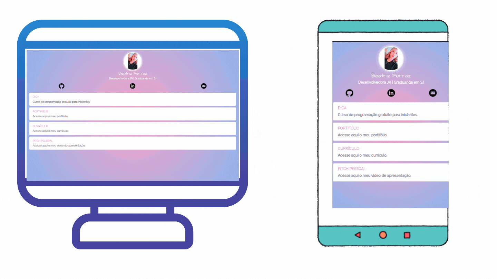

# Meu Linktree

<h3 align="center">
    <a href="https://bea-ferraz.github.io/linktree/">Acessar a demonstração</a>
<h3 >

# Indice

- [Sobre](#-sobre)
- [Tecnologias Utilizadas](#-tecnologias-utilizadas)

## 🔖&nbsp; Sobre

Projeto **linketree**: O Linktree permite que você crie uma página personalizada e facilmente personalizável, que abriga todos os links importantes que você deseja compartilhar com seu público. 
---

## 🚀 Tecnologias utilizadas

O projeto foi desenvolvido utilizando as seguintes tecnologias.

- [WEB DESIGN RESPONSIVO](https://developer.mozilla.org/pt-BR/docs/Learn/CSS/CSS_layout/Flexbox)

- [HTML5](https://www.w3schools.com/html/)

- [CSS](https://www.w3schools.com/css/)

- [FLEXBLOX](https://developer.mozilla.org/pt-BR/docs/Learn/CSS/CSS_layout/Flexbox)

---
### Desenvolvido por:
* [Beatriz Ferraz](https://github.com/bea-ferraz)
